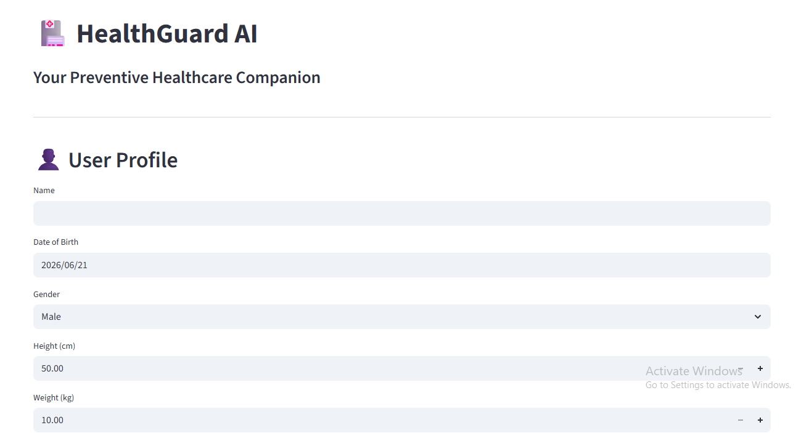
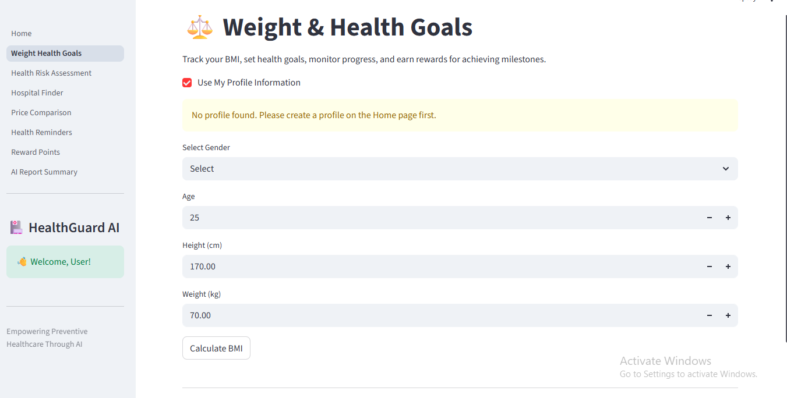
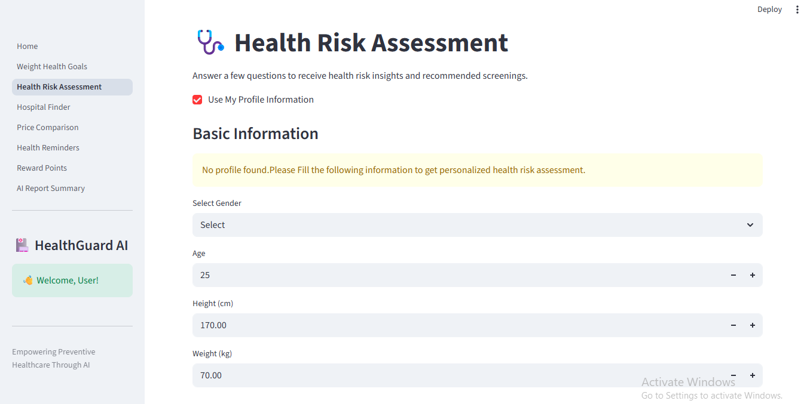
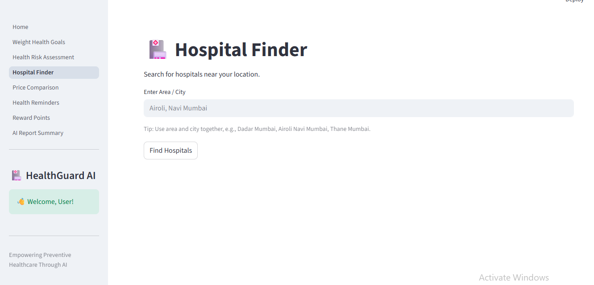
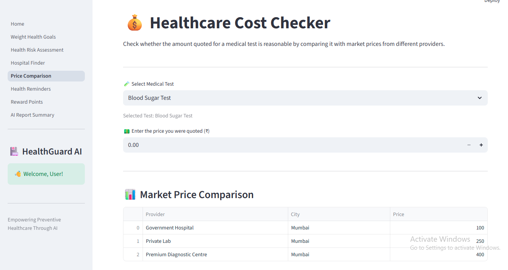
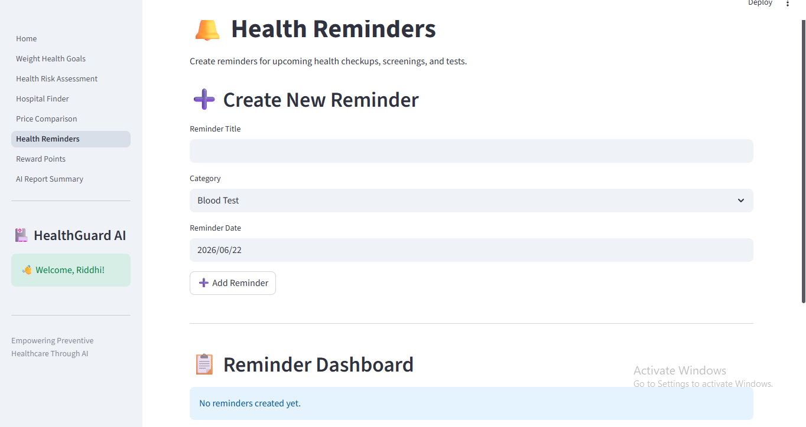
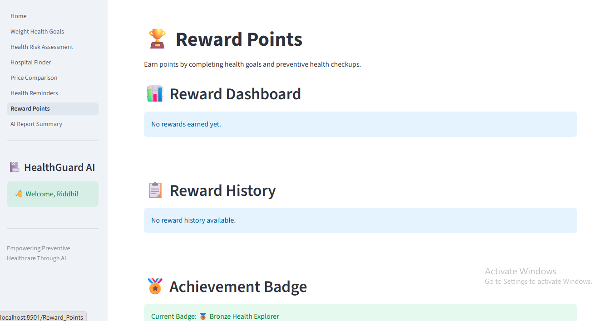
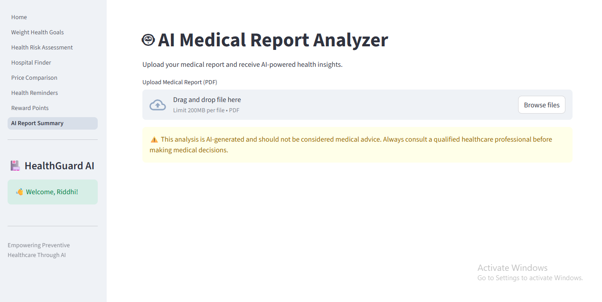

# 🏥 HealthGuard AI

## Overview

HealthGuard AI is an AI-powered preventive healthcare web application developed using Streamlit, Python, and Google Gemini AI. The project was inspired by and built as an extension of my earlier Aavishkar Preventive Healthcare research project, which explored the impact of healthcare costs and awareness on participation in preventive health check-ups.

The project aims to encourage preventive healthcare by helping users track health goals, assess potential health risks, compare healthcare costs, manage reminders, earn rewards for healthy behavior, and analyze medical reports using artificial intelligence.

The application transforms research insights into a practical healthcare solution by combining health analytics, personalized tracking, healthcare cost comparison, preventive care management, and AI-powered health assistance.

---

## Project Evolution

### Phase 1: Aavishkar Preventive Healthcare Research

- Conducted a survey-based study on preventive healthcare participation.
- Analyzed the influence of healthcare costs and awareness on preventive check-ups.
- Applied statistical techniques to identify barriers and trends.
- Proposed technology-driven solutions to improve preventive healthcare adoption.

### Phase 2: HealthGuard AI

- Converted research findings into a functional healthcare application.
- Added BMI and weight goal tracking.
- Implemented health risk assessment tools.
- Developed healthcare cost comparison features.
- Added reminders and reward-based engagement.
- Integrated Google Gemini AI for medical report analysis.
- Built an interactive web application using Streamlit.

---

## Key Features

### 👤 User Profile Management

* Create and manage a personal health profile
* Store age, gender, height, and weight information
* Automatically personalize health-related modules

### ⚖️ Weight Goal & BMI Tracking

* Calculate BMI using profile information
* Set weight gain or weight loss goals
* Track progress over time
* Visualize weight trends through charts
* Earn reward points for completing goals

### 🩺 Health Risk Assessment

* Assess potential health risks based on:

  * Symptoms
  * Lifestyle habits
  * Age
  * BMI
* Receive personalized health insights
* Get recommended medical tests and preventive screenings

### 🏥 Hospital Finder

* Search hospitals near a specified location
* View hospital information
* Open locations directly in Google Maps

### 💰 Healthcare Cost Checker

* Compare medical test costs across providers
* Evaluate whether quoted prices are reasonable
* Identify cost-saving opportunities
* View market price comparisons and analytics

### 🔔 Health Reminders

* Create reminders for:

  * Health checkups
  * Screenings
  * Vaccinations
  * Medical tests
* Track reminder completion status
* Earn reward points for completed reminders

### 🏆 Reward System

* Earn points for maintaining healthy habits
* Track completed activities
* Unlock achievement badges:

  * Bronze Health Explorer
  * Silver Health Champion
  * Gold Wellness Master
  * Platinum Health Legend

### 🤖 AI Medical Report Analyzer

* Upload medical reports in PDF format
* Extract report contents automatically
* Generate:

  * Simple summaries
  * Key findings
  * Potential health concerns
  * Recommended follow-up tests
  * Lifestyle suggestions
* Powered by Google Gemini AI

---

## Why Some Features Require a User Profile

Certain modules require a user profile because they depend on personal health information to generate meaningful and accurate results.

### Pages Requiring a Profile

#### Weight Goal Tracker

Requires current weight, height, and BMI information to:

* Calculate BMI
* Create realistic goals
* Monitor progress accurately

#### Health Reminders

Reminders are linked to a specific user’s health journey and reward system. Allowing multiple anonymous users could create inconsistencies in reminder tracking and reward allocation.

#### Reward Points

Reward points are earned through personal health activities such as completing goals and reminders. These rewards must remain associated with the correct user profile.

### Pages That Do Not Require a Profile

The following pages remain accessible without creating a profile:

* Health Risk Assessment
* Hospital Finder
* Healthcare Cost Checker
* AI Medical Report Analyzer

These modules can provide value without requiring personal data storage.

---

## Technology Stack

### Technologies Used

- Python
- Streamlit
- Pandas
- Requests
- PDFPlumber
- Google Generative AI SDK
- Google Gemini 2.5 Flash

### Libraries

* Pandas
* Requests
* PDFPlumber
* Google Generative AI SDK

### AI Integration

* Google Gemini 2.5 Flash

---

## Project Screenshots

### 🏠 Home Page

---

### ⚖️ Weight Goal Tracker

---

### 🩺 Health Risk Assessment

---

### 🏥 Hospital Finder

---

### 💰 Healthcare Cost Checker

---

### 🔔 Health Reminders

---

### 🏆 Reward Points

---

### 🤖 AI Medical Report Analyzer

---

## Related Project

This application is an extension of my earlier research project:

🔗 Aavishkar Preventive Healthcare Research Project

The original research investigated preventive healthcare participation, healthcare affordability, and awareness-related barriers. HealthGuard AI extends these findings by transforming proposed solutions into an interactive healthcare application.

--- 

## Live Demo

[Streamlit App Link]

The application can also be run locally using:

streamlit run Home.py

## Disclaimer

HealthGuard AI is intended for educational and preventive healthcare purposes only.

The AI-generated insights and recommendations provided by this application should not be considered medical advice, diagnosis, or treatment. Users should always consult qualified healthcare professionals before making healthcare decisions.

---

## Author

**Riddhi Kore**

