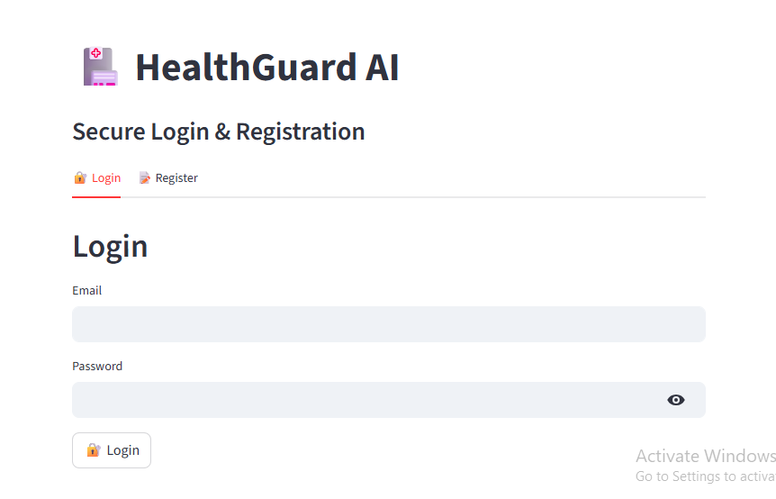
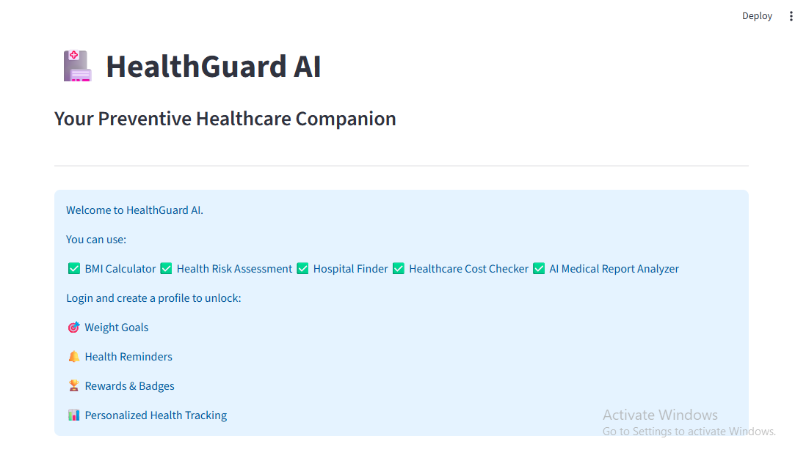

# 🏥 HealthGuard AI

## Overview

HealthGuard AI is an AI-powered preventive healthcare web application developed using Python, Streamlit, and Google Gemini AI. The project was inspired by my Aavishkar Preventive Healthcare research study, which examined the impact of healthcare costs and awareness on participation in preventive health check-ups.

The application transforms research findings into a practical healthcare solution by combining health analytics, preventive healthcare management, cost comparison, personalized tracking, and AI-powered health assistance.

Users can assess health risks, monitor BMI and weight goals, compare healthcare costs, manage reminders, earn rewards for healthy habits, discover nearby hospitals, and analyze medical reports using artificial intelligence.

---

## Project Status

HealthGuard AI is a portfolio and academic project developed to demonstrate the application of Data Analytics, Artificial Intelligence, and Preventive Healthcare concepts in a real-world setting.

The application has been deployed as a functional Streamlit web application and integrates Google Gemini AI for automated medical report analysis.

Current data storage uses CSV-based persistence for demonstration and educational purposes.

## Key Features

### 👤 User Profile Management

* Create and manage personal health profiles
* Store age, gender, height, and weight information
* Personalize healthcare modules automatically

### ⚖️ Weight Goal & BMI Tracking

* BMI calculation and classification
* Weight gain and weight loss goal tracking
* Progress visualization through charts
* Reward points for goal completion

### 🩺 Health Risk Assessment

* Symptom-based health risk screening
* Lifestyle and BMI-based risk analysis
* Personalized health insights
* Recommended tests and preventive screenings

### 🏥 Hospital Finder

* Search hospitals by location
* View hospital details
* Direct Google Maps integration

### 💰 Healthcare Cost Checker

* Compare healthcare costs across providers
* Evaluate quoted prices against market averages
* Identify potential cost savings
* Visualize provider-wise price comparisons

### 🔔 Health Reminders

* Create reminders for tests, screenings, vaccinations, and checkups
* Track reminder completion status
* Automatic reminder management

### 🏆 Reward System

* Earn points for healthy activities
* View reward history and analytics
* Unlock achievement badges

### 🤖 AI Medical Report Analyzer

* Upload medical reports in PDF format
* Extract report content automatically
* Generate AI-powered summaries and insights
* Suggest follow-up tests and lifestyle recommendations

---

## Technology Stack

### Languages & Tools

* Python
* Streamlit
* Pandas
* Requests
* PDFPlumber
* Git & GitHub

### AI & APIs

* Google Gemini 2.5 Flash
* OpenStreetMap Nominatim API

### Data Handling

* CSV-based storage
* Pandas DataFrames

## Skills Demonstrated

* Data Analysis
* Data Visualization
* Python Programming
* Streamlit Web Development
* API Integration
* Artificial Intelligence Integration
* Prompt Engineering
* Healthcare Analytics
* User Authentication Logic
* Dashboard Development
* Git & GitHub Version Control

---

## Project Impact

* Developed a multi-page preventive healthcare application integrating analytics, AI, and healthcare management tools.
* Built modules for health tracking, reminders, rewards, hospital discovery, and healthcare cost comparison.
* Integrated Google Gemini AI to generate summaries and insights from uploaded medical reports.
* Converted findings from an academic healthcare research project into a functional software solution.
* Applied data analysis, visualization, and AI-powered decision support in a healthcare use case.

---

## Project Screenshots

### 🔐 Login & Registration



### 🏠 Home Page



### ⚖️ Weight Goal Tracker


### 🩺 Health Risk Assessment


### 🏥 Hospital Finder


### 💰 Healthcare Cost Checker


### 🔔 Health Reminders


### 🏆 Reward Points


### 🤖 AI Medical Report Analyzer


## Live Demo

HealthGuard AI is deployed on Streamlit Cloud:
[Streamlit App Link](https://healthguard-ai-nmo5tvzdpjqu4e8buj5f8s.streamlit.app/)

---

## Run Locally

Clone the repository:

```bash
git clone https://github.com/Riddhi2805/HealthGuard-AI.git
```

Install dependencies:

```bash
pip install -r requirements.txt
```

Run the application:

```bash
streamlit run Login.py
```

---

## Related Research

This project extends my earlier Aavishkar Preventive Healthcare research study, which investigated healthcare affordability, awareness, and participation in preventive health check-ups.

HealthGuard AI converts those research findings into a practical healthcare analytics and AI-driven application.

---

## Disclaimer

HealthGuard AI is intended for educational and preventive healthcare purposes only.

The AI-generated insights and recommendations provided by this application should not be considered medical advice, diagnosis, or treatment. Users should always consult qualified healthcare professionals before making healthcare decisions.

---

## Author

**Riddhi Kore**

